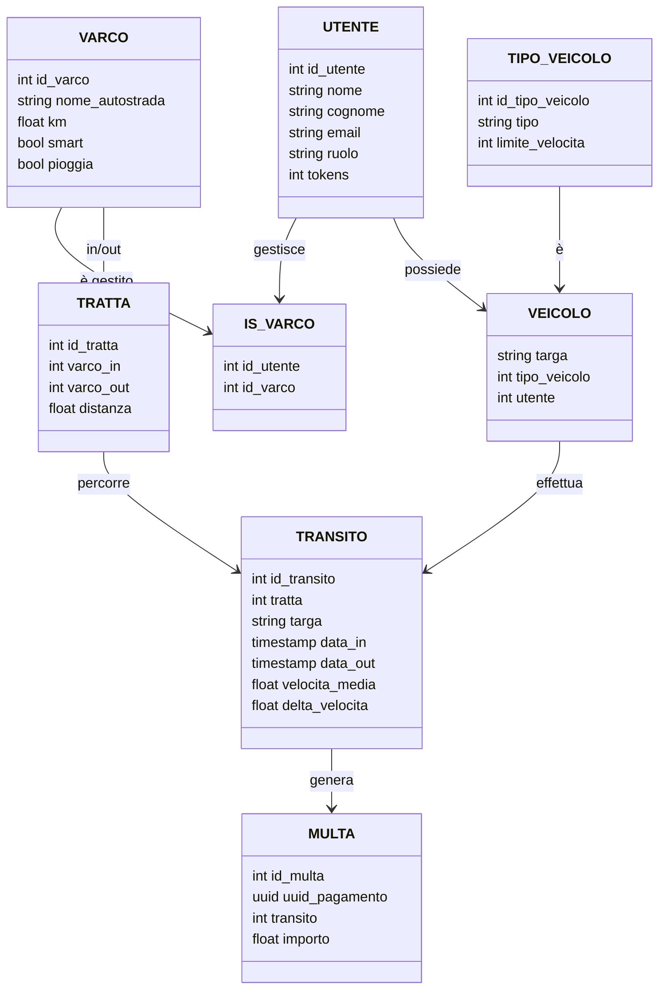
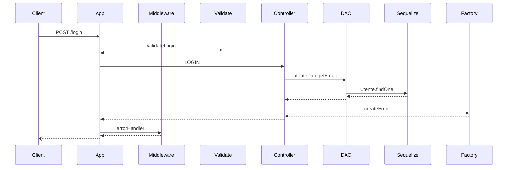
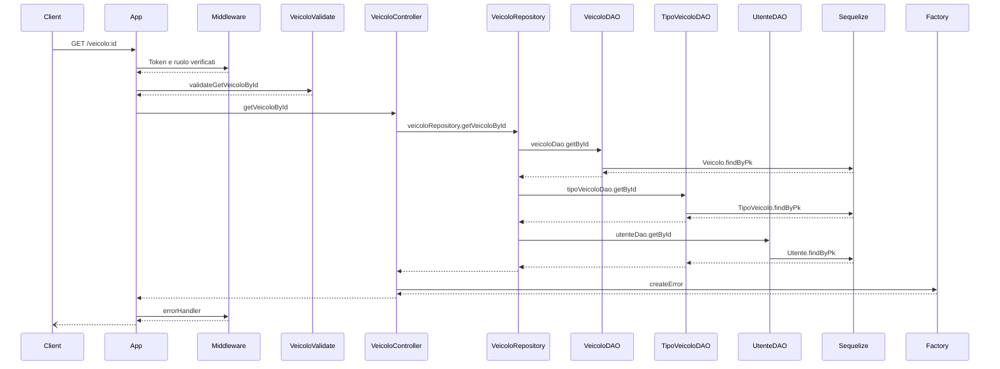
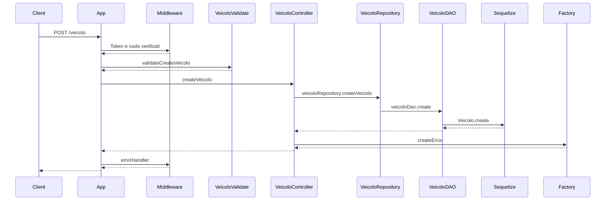
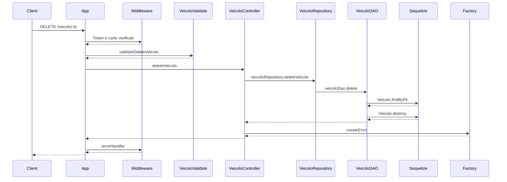
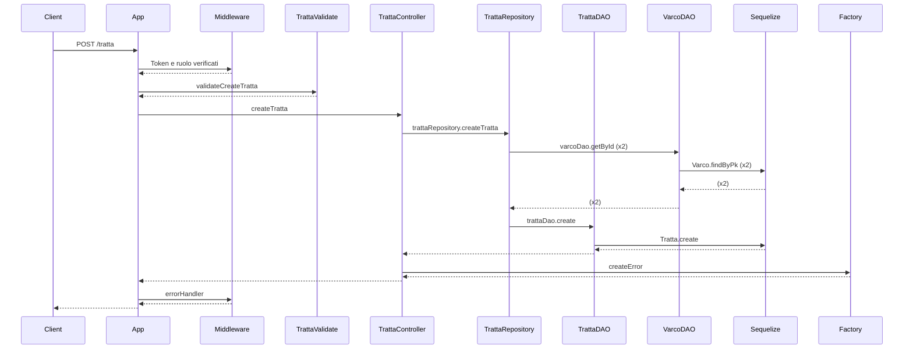
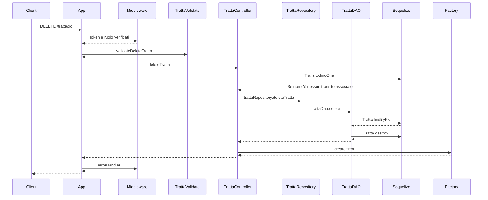
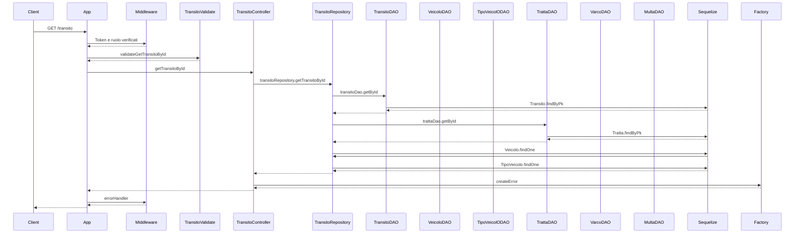
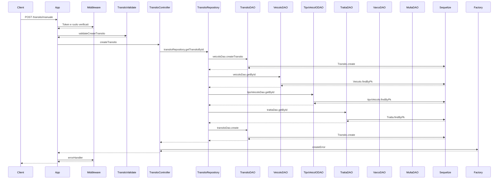

# 📌 Progetto Programmazione Avanzata 2024-2025
<div align="center">
  
</div>

# 📚 Indice
- [🎯 Obiettivo](#obiettivo)
- [🛠️ Progettazione](#progettazione)
  - [🏗️ Architettura](#architettura)
  - [🧑‍💼 Diagramma dei casi d'uso](#diagramma-dei-casi-duso)
  - [🗂️ Diagramma E‑R](#diagramma-e-r)
  - [🧩 Pattern Utilizzati](#pattern-utilizzati)
  - [📈 Diagrammi delle sequenze](#diagrammi-delle-sequenze)
- [🌐 Rotte API](#rotte-api)
- [⚙️ Setup & Installazione](#setup--installazione)
- [🧰 Strumenti utilizzati](#strumenti-utilizzati)
- [💡 Scelte implementative](#scelte-implementative)
- [👥 Autori](#autori)

---

## [🎯 Obiettivo](#obiettivo)

Il progetto consiste nella realizzazione di un sistema backend per la gestione dei transiti di veicoli tra varchi autostradali, con calcolo automatico di eventuali **multe** in base alla **velocità media** rilevata. Il sistema supporta **OCR (Tesseract.js)** per l'identificazione automatica delle targhe, gestione utenti con **JWT**, **CRUD completo per varchi, tratte, veicoli e transiti**, generazione di **bollettini PDF** e ruoli differenziati (Operatore, Varco, Automobilista).

---

## [🛠️ Progettazione](#progettazione)

### [🏗️ Architettura](#architettura)

- **Node.js** con **Express** per la gestione delle API REST
- **Sequelize** come ORM per l'interazione con un database **PostgreSQL**
- **Autenticazione JWT** e gestione dei ruoli
- **OCR con Tesseract.js** per lettura targa da immagini
- **Docker Compose** per orchestrazione dei servizi
- **Test con Jest** + **Postman Collection**

```
  Utente      API Server        Backend Server         PostgreSQL
  |               |                  |                    |
  |  ---> Richiesta HTTP  -------->  |                    |
  |               |  --> Elabora logica (Node.js)        |
  |               |                  |  ---> Query ------>|
  |               |                  |  <--- Risposta ----|
  |               |  <-- Risultato --|                    |
  |  <--- Risposta HTTP -------------|                    |
```
Il sistema adotta un'architettura **client-server** strutturata su più livelli:
- L'utente (es. operatore, varco o automobilista) effettua una richiesta HTTP (es. `GET`, `POST`) verso il **server Express.js**, autenticandosi tramite **token JWT**.
- Il **backend** gestisce la logica applicativa (validazioni, controlli sui ruoli, calcoli di velocità o multe, OCR targa, etc.).
- Quando necessario, il backend comunica con il **database PostgreSQL** attraverso **Sequelize**, per leggere o aggiornare i dati persistenti (veicoli, transiti, multe, tratte, etc.).
- Infine, una **risposta JSON** viene restituita all'utente.

Questo flusso garantisce una separazione chiara tra livelli e sicurezza tramite autenticazione. Inoltre, l'architettura si riflette sulla struttura stessa del progetto, poiché le **directory** sono organizzate come di seguito:
```
ProgettoPA
├── backend
│   ├── src
│   │   ├── controllers
│   │   ├── dao
│   │   ├── middleware
│   │   ├── models
│   │   ├── repositories
│   │   ├── routes
│   │   ├── utils
│   │   └── app.ts
│   │   └── server.ts
│   ├── Dockerfile
│   ├── package-lock.json
│   ├── package.json
│   └── tsconfig.json
├── db
|   └── init.sql
├── images
|   ├── logo.png
|   ├── targa1.png
|   ├── targa2.png
│   └── targa3.png
├── test_postman
├──docker-compose.yml
├──LICENSE
└──README.md
```


### [🧑‍💼 Diagramma dei casi d'uso](#diagramma-dei-casi-duso)
Nel sistema sviluppato, ci sono 3 tipologie di utenti: Automobilista, Operatore e Varco.
Ognuno può interagire con il sistema per svolgere determinate operazioni:
- **Automobilista**: può autenticarsi, vedere le proprie multe (anche in un determinato periodo) e scaricare un bollettino di pagamento.
- **Operatore**: può autenticarsi, gestire i varchi, le tratte, i veicoli e i transiti, può vedere le multe di tutti gli utenti (anche in un determinato periodo) e scaricare un bollettino di pagamento.
- **Varco**: può autenticarsi e inserire un transito (manualmente o in automatico).


### [🗂️ Diagramma E-R](#diagramma-e-r)
Il sistema utilizza **PostgreSQL** come RDBMS, il quale è particolarmente indicato per applicazioni back-end come quella sviluppata in questo progetto, dove l'autenticazione sicura dei dati e l'efficienza nelle operazioni di lettura e scrittura sono fondamentali. Grazie alle sue prestazioni ottimizzate, PostgreSQL rappresenta una soluzione ideale per garantire la robustezza e la velocità del sistema.


### [🧩 Pattern Utilizzati](#pattern-utilizzati)
Nel progetto sono stati adottati diversi design pattern per garantire modularità, manutenibilità e scalabilità del codice. Di seguito una descrizione dei principali pattern e dei vantaggi che hanno apportato all’architettura.

- **MVC (Model-View-Controller)**

È stato utilizzato il pattern MVC per separare chiaramente i ruoli tra dati, logica e interfaccia: i modelli definiscono la struttura dei dati (grazie a Sequelize), i controller gestiscono la logica delle richieste HTTP, e la "vista" corrisponde alle risposte API restituite ai client (in formato JSON). Questa struttura permette di lavorare in modo modulare e mantenere il codice pulito.

- **DAO (Data Access Object)**

Per isolare ulteriormente la logica di accesso al database, sono stati introdotti i DAO (Data Access Object). Ogni DAO si occupa delle interazioni dirette con il database, come query, inserimenti o aggiornamenti, in modo centralizzato. Questo approccio semplifica il testing e rende più semplice cambiare il backend (ad esempio, da Sequelize a un’altra libreria) senza modificare tutta l’applicazione.

- **REPOSITORY**

A un livello superiore, i Repository orchestrano più DAO e incapsulano logiche applicative più complesse. Sono responsabili di operazioni che coinvolgono più entità o che richiedono calcoli specifici (come la generazione di multe, calcoli di velocità, ecc.). Questo migliora la leggibilità dei controller e favorisce una divisione dei compiti chiara.
- **COR (Chain of Responsability)**

Per alcune funzionalità che richiedono una valutazione progressiva e flessibile, come l’analisi delle condizioni di un transito per determinare se va multato o meno, è stato adottato il Chain of Responsibility. Questo pattern permette di definire una catena di controlli, dove ciascun "anello" della catena può decidere se gestire la richiesta o passarla avanti. Questo approccio è molto utile per evitare blocchi di `if` annidati e rende più semplice aggiungere nuove regole senza modificare quelle esistenti.
I middleware, in particolare, permettono la creazione della catena di responsabilità, poiché [Express.js](https://expressjs.com/) stesso fa un ampio uso di questo pattern. I middleware, infatti, sono funzioni che vengono eseguite in sequenza per gestire le richieste HTTP. Sfruttando il COR, sono state implementate le seguenti funzionalità dei middleware:
  - **Middleware di autenticazione**: verifica se l'utente è autenticato e autorizzato ad eseguire l'operazione richiesta, sfruttando la verifica tramite JWT. Se non lo è, restituisce una risposta d'errore; altrimenti, passa la richiesta al middleware successivo.
  - **Middleware di validazione**: viene utilizzato per validare i dati di una richiesta, che possono essere passati come `param` o `body`. Se i dati non sono validi, restituisce una risposta d'errore; altrimenti, passa la richiesta al middleware successivo.
  - **Middleware di gestione degli errori**: intercetta eventuali errori verificatisi nei middleware precedenti e restituisce una risposta d'errore appropriata, sfruttando un `errorHandler` personalizzato con il pattern Factory.

- **FACTORY**

Per la gestione personalizzata degli errori è stato scelto l'utilizzo del design pattern comportamentale Factory, il quale permette di delegare la creazione di oggetti a una factory (fabbrica), che decide quale tipo di oggetto creare in base a determinati parametri parametri forniti.
All'interno del sistema sviluppato, il pattern è stato utilizzato per la creazione di errori personalizzati attraverso l'`errorHandler`, che fornisce un metodo per creare istanze di errori `HttpError` con diversi tipi e messaggi, sfruttando anche l'utilizzo della libreria `http-status-code` per la stampa dei codici di errore, incapsulando la logica di creazione degli errori in un'unica classe. In questo modo, risulta particolarmente facilitata la gestione e la possibile estensione degli errori, essendo l'intera logica localizzata in un unico punto.

- **SINGLETON**

Infine, il pattern Singleton è stato usato dove è necessario garantire una sola istanza condivisa in tutto il sistema, come ad esempio per alcune configurazioni, o per servizi che devono essere accessibili ovunque, senza duplicazioni.

L’uso combinato di questi pattern ha permesso di realizzare un’architettura robusta, estendibile e pronta per evolversi in progetti futuri più complessi.

### [📈 Diagrammi delle sequenze](#diagramma-delle-sequenze)

I diagrammi di sequenza illustrano lo scambio di messaggi tra oggetti che interagiscono tra loro, fornendo una rappresentazione chiara e dettagliata del flusso di comunicazione. Sono particolarmente efficaci per comprendere il funzionamento delle interazioni in sistemi basati su API, dove evidenziano le richieste e risposte tra le diverse entità coinvolte.

Dato che la maggior parte dei diagrammi risultavano con la stessa struttura, mostreremo di seguito soltanto alcuni di essi, quelli di maggior interesse e particolarità.

- **POST /login**
La rotta descritta costituisce il punto centrale del meccanismo di autenticazione dell'intero sistema. In fase di login, l'utente invia una richiesta con le proprie credenziali al middleware di autenticazione (`authMiddleware`), che accede all'ambiente di esecuzione (`.env`) per recuperare la chiave segreta utilizzata nella firma dei token JWT.
Una volta ottenuta la chiave, il middleware genera un token JWT firmato, contenente le informazioni di autenticazione dell’utente, e lo restituisce come risposta alla richiesta iniziale.
Successivamente, per accedere alle rotte protette, l’utente include il token nelle richieste. Il middleware intercetta la richiesta e utilizza nuovamente la chiave segreta per verificare l’autenticità del token. Se il token è valido, la libreria JWT restituisce il payload decodificato, consentendo l’accesso alla risorsa richiesta. In caso contrario, il token viene considerato non valido e il middleware genera un errore, restituendo un messaggio di accesso negato.

Il token JWT, una volta ottenuto, sarà dunque utilizzato dall’utente per autenticarsi nelle richieste successive verso le API che richiedono autorizzazione.



- **GET /veicolo/:id**
La chiamata `GET /veicolo/:id` consente al client di recuperare le informazioni di un veicolo specifico, identificato tramite il suo ID. Quando la richiesta viene inviata, il sistema verifica innanzitutto il token JWT e il ruolo dell’utente tramite il middleware di autenticazione. Se l’autenticazione ha esito positivo, viene avviata la validazione dei parametri della richiesta, in particolare dell'ID del veicolo.
Successivamente, il controller richiama il repository per ottenere i dati del veicolo. Quest'ultimo si appoggia al DAO, che interroga il database tramite Sequelize, utilizzando il metodo `findByPk` per cercare il veicolo tramite chiave primaria. Se il veicolo non viene trovato, viene generato un errore tramite una factory di errori, che viene poi gestito dal middleware degli errori. Infine, la risposta viene inviata al client, contenente o i dati del veicolo richiesto oppure un messaggio d’errore se il veicolo non esiste o la richiesta è invalida.


- **POST /veicolo**
La chiamata `POST /veicolo` permette al client di creare un nuovo veicolo all'interno del sistema. Una volta ricevuta la richiesta, l'applicazione verifica l’autenticità del token JWT e i privilegi dell’utente tramite il middleware di autenticazione.

Se l’accesso è autorizzato, i dati forniti vengono validati per assicurarsi che rispettino i requisiti previsti per la creazione di un veicolo (targa, tipo, utente). Dopo la validazione, il controller attiva il processo di creazione chiamando il repository, che a sua volta si appoggia al DAO per interagire con il database.

Il DAO utilizza Sequelize per inserire il nuovo record nella tabella dei veicoli. Una volta completata l’operazione, i dati del nuovo veicolo vengono restituiti risalendo la catena. Se si verifica un errore (ad esempio un duplicato o un problema di integrità), viene generato tramite la factory degli errori e gestito dal middleware di error handling, che infine invia una risposta di errore o successo al client, a seconda dell’esito.


- **DELETE /veicolo**
La chiamata `DELETE /veicolo/:id` consente al client di eliminare un veicolo specifico identificato tramite il suo ID. Una volta inviata la richiesta, il sistema verifica il token JWT e il ruolo dell’utente per accertarsi che l’operazione sia autorizzata.

Dopo l’autenticazione, viene effettuata la validazione dell’ID del veicolo da eliminare. Superata la validazione, il controller invoca il repository, che a sua volta chiama il DAO per gestire l’eliminazione. Il DAO interroga il database tramite Sequelize, inizialmente cercando il veicolo con `findByPk` per verificarne l’esistenza. Se il veicolo è presente, viene eseguita l’operazione di cancellazione con `destroy`.

Il risultato dell’operazione viene quindi risalito fino al controller. Se si verifica un errore, viene creato tramite la factory degli errori e gestito dal middleware di errore. Infine, viene inviata al client una risposta che conferma l’avvenuta eliminazione o comunica l’errore rilevato.


- **POST /tratta**
Questa rotta gestisce la creazione di una nuova tratta, cioè un collegamento tra due varchi. Dopo l’invio della richiesta da parte del client, il middleware autentica l’utente e ne controlla i privilegi.

Il corpo della richiesta viene validato per verificare la correttezza delle informazioni, in particolare degli ID dei due varchi estremi. Il controller, tramite il repository, effettua due interrogazioni al DAO dei varchi (`varcoDao.getById`) per verificare che entrambi esistano nel sistema.

Se i varchi sono validi, si procede con la creazione della tratta nel database tramite il DAO (`trattaDao.create`), che sfrutta `Sequelize.Tratta.create.` Infine, il risultato viene risalito fino al client. In caso di problemi (varchi inesistenti, errore di creazione, ecc.), viene generato e gestito un errore.


- **DELETE /tratta/:id**
Questa rotta permette di eliminare una tratta specificata tramite il suo ID. Dopo l’autenticazione e la verifica del ruolo da parte del middleware, l’ID fornito viene validato.

Il controller controlla che non ci siano transiti associati alla tratta tramite una query (`Transito.findOne`). Se la tratta non è collegata ad alcun transito (quindi può essere eliminata senza violare integrità referenziale), il controller procede all’eliminazione passando per il repository e il DAO.

Il DAO interroga il database per verificare l’esistenza della tratta (`findByPk`) e, se presente, la elimina con `destroy`. Eventuali errori vengono gestiti attraverso la factory e propagati al middleware, che fornisce la risposta al client.


- **GET /transito**


- **POST /transito/manuale**


- **POST /transito/smart**
```mermaid

```
  
- **DELETE /transito**
```mermaid

```


## [🌐 Rotte API](#rotte-api)

Le rotte sono tutte autenticate con JWT e prevedono il controllo del ruolo dell'utente.
All'interno del sistema sono presenti delle rotte aggiuntive per permettere di visualizzare, aggiungere, aggiornare o cancellare ulteriori informazioni, che riguardano `tipoVeicolo`, per scopi di completezza.

### Utente
- `POST /login` – Login utente

### Varchi (`/varco`)
- `GET /` – Elenco varchi [operatore]
- `GET /:id` – Cerca varco [operatore]
- `POST /` – Crea varco [operatore]
- `PUT /:id` – Modifica varco [operatore]
- `DELETE /:id` – Elimina varco [operatore]

### Tratte (`/tratta`)
- `GET /` – Elenco tratte [operatore]
- `GET /` – Cerca tratta [operatore]
- `POST /` – Crea tratta (v_in, v_out, distanza) [operatore]
- `PUT /:id` – Modifica tratta [operatore]
- `DELETE /:id` – Elimina tratta [operatore]

### Veicoli (`/veicolo`)
- `GET /` – Elenco veicoli [operatore]
- `GET /:targa` – Cerca veicolo [operatore]
- `POST /` – Crea veicolo [operatore]
- `PUT /:targa` – Modifica veicolo [operatore]
- `DELETE /:targa` – Elimina veicolo [operatore]

### Veicoli (`/tipoVeicolo`)
- `GET /` – Elenco tipo veicoli [operatore]
- `GET /:id` – Cerca tipo veicolo [operatore]
- `POST /` – Crea tipo veicolo [operatore]
- `PUT /:id` – Modifica tipo veicolo [operatore]
- `DELETE /:id` – Elimina tipo veicolo [operatore]

### Transiti (`/transito`)
- `GET /` – Elenco transiti [operatore]
- `GET /:id` – Cerca transito [operatore]
- `POST /manuale` – Inserimento da operatore o varco non smart [operatore/varco]
- `POST /smart` – Inserimento da varco smart [varco]
- `PUT /:id` – Modifica transito [operatore]
- `DELETE /:id` – Elimina transito [operatore]

### Multe (`/api/multe`)
- `GET /` – Elenco multe [operatore]
- `GET /dettagli` – Lista multe per targa e periodo [operatore/automobilista]
- `GET /:id/pdf` – Scarica PDF con QR code del bollettino di pagamento [operatore/automobilista]

---

## [⚙️ Setup & Installazione](#setup-e-installazione)
Per l'installazione e la configurazione del progetto è necessario innanzitutto installare [Docker](https://www.docker.com/) e [docker-compose](https://docs.docker.com/compose/). Successivamente, bisogna eseguire la *clone* della repository. Per far ciò, è sufficiente eseguire i seguenti comandi sul proprio terminale:
```
# Clona il repository
git clone https://github.com/MattSona99/ProgettoPA.git

# Entra nella cartella del progetto
cd ProgettoPA

# Importa il file '.env' all'interno della directory principale

# Avvia il progetto
docker-compose up --build
```
Esempio di file .env
```
DB_NAME=progettoPA_DB
DB_USER=myuser
DB_PASSWORD=mypassword
DB_PORT=5432
DB_HOST=postgres

BACKEND_PORT=3000
JWT_SECRET=your_secret_key
```
Il sistema sarà in ascolto all'indirizzo `http://127.0.0.1:3000`. Le rotte API possono essere testate tramite [Postman](https://www.postman.com/).

## [🧰 Strumenti utilizzati](#strumenti-utilizzati)
Per lo sviluppo dell'applicazione presentata sono stati utilizzati i seguenti strumenti di lavoro:

* [Typescript](https://www.typescriptlang.org/) come linguaggio di programmazione principale;

* [Express.js](https://expressjs.com/) come framework per applicazioni Web per Node.js;

* [Node.js](https://nodejs.org/en) come sistema per la gestione di moduli e pacchetti;

* [Tesseract.js](https://github.com/tesseract-ocr/tesseract) per la lettura di file di testo nelle immagini;

* [Sequelize](https://sequelize.org/) per l'Object Relational Mapping (ORM);

* [Docker](https://www.docker.com/) come sistema di containerizzazione per il deployment dell'applicazione;

* [PostgreSQL](https://www.postgresql.org/) come database;

* [Postman](https://www.postman.com/) per il testing delle rotte API;

* [JWT](https://jwt.io/) per la trasmissione sicura di informazioni tra le parti

* [GitHub](https://github.com/) come piattaforma di condivisione e versioning del codice;

* [Visual Studio Code](https://code.visualstudio.com/) come editor di codice.

## [💡 Scelte implementative](#scelte-implementative)

## [👥 Autori](#autori)
|Nome | GitHub |
|-----------|--------|
|`Sonaglioni Matteo` | [Clicca qui!](https://github.com/MattSona99) |
|`Cingoli Enzo` | [Clicca qui!](https://github.com/enzoc2000) |
