# 📌 Progetto Programmazione Avanzata 2024-2025
<div align="center">
  
</div>

# 📚 Indice
- [🎯 Obiettivo](#obiettivo)
- [🛠️ Progettazione](#progettazione)
  - [🏗️ Architettura](#architettura)
  - [🧑‍💼 Diagramma dei casi d'uso](#diagramma-dei-casi-duso)
  - [🗂️ Diagramma E‑R](#diagramma-e-r)
  - [🧩 Pattern Utilizzati](#pattern-utilizzati)
  - [📈 Diagrammi delle sequenze](#diagrammi-delle-sequenze)
- [🌐 Rotte API](#rotte-api)
- [⚙️ Setup & Installazione](#setup--installazione)
- [🧰 Strumenti utilizzati](#strumenti-utilizzati)
- [💡 Scelte implementative](#scelte-implementative)
- [👥 Autori](#autori)

---

## [🎯 Obiettivo](#obiettivo)

Il progetto consiste nella realizzazione di un sistema backend per la gestione dei transiti di veicoli tra varchi autostradali, con calcolo automatico di eventuali **multe** in base alla **velocità media** rilevata. Il sistema supporta **OCR (Tesseract.js)** per l'identificazione automatica delle targhe, gestione utenti con **JWT**, **CRUD completo per varchi, tratte, veicoli e transiti**, generazione di **bollettini PDF** e ruoli differenziati (Operatore, Varco, Automobilista).

---

## [🛠️ Progettazione](#progettazione)

### [🏗️ Architettura](#architettura)

- **Node.js** con **Express** per la gestione delle API REST
- **Sequelize** come ORM per l'interazione con un database **PostgreSQL**
- **Autenticazione JWT** e gestione dei ruoli
- **OCR con Tesseract.js** per lettura targa da immagini
- **Docker Compose** per orchestrazione dei servizi
- **Test con Jest** + **Postman Collection**

```
  Utente      API Server        Backend Server         PostgreSQL
  |               |                  |                    |
  |  ---> Richiesta HTTP  -------->  |                    |
  |               |  --> Elabora logica (Node.js)        |
  |               |                  |  ---> Query ------>|
  |               |                  |  <--- Risposta ----|
  |               |  <-- Risultato --|                    |
  |  <--- Risposta HTTP -------------|                    |
```
Il sistema adotta un'architettura **client-server** strutturata su più livelli:
- L'utente (es. operatore, varco o automobilista) effettua una richiesta HTTP (es. `GET`, `POST`) verso il **server Express.js**, autenticandosi tramite **token JWT**.
- Il **backend** gestisce la logica applicativa (validazioni, controlli sui ruoli, calcoli di velocità o multe, OCR targa, etc.).
- Quando necessario, il backend comunica con il **database PostgreSQL** attraverso **Sequelize**, per leggere o aggiornare i dati persistenti (veicoli, transiti, multe, tratte, etc.).
- Infine, una **risposta JSON** viene restituita all'utente.

Questo flusso garantisce una separazione chiara tra livelli e sicurezza tramite autenticazione. Inoltre, l'architettura si riflette sulla struttura stessa del progetto, poiché le **directory** sono organizzate come di seguito:
```
ProgettoPA
├── backend
│   ├── src
│   │   ├── controllers
│   │   ├── dao
│   │   ├── middleware
│   │   ├── models
│   │   ├── repositories
│   │   ├── routes
│   │   ├── utils
│   │   └── app.ts
│   │   └── server.ts
│   ├── Dockerfile
│   ├── package-lock.json
│   ├── package.json
│   └── tsconfig.json
├── db
|   └── init.sql
├── images
|   ├── logo.png
|   ├── targa1.png
|   ├── targa2.png
│   └── targa3.png
├── test_postman
├──docker-compose.yml
├──LICENSE
└──README.md
```


### [🧑‍💼 Diagramma dei casi d'uso](#diagramma-dei-casi-duso)
Nel sistema sviluppato, ci sono 3 tipologie di utenti: Automobilista, Operatore e Varco.
Ognuno può interagire con il sistema per svolgere determinate operazioni:
- **Automobilista**: può autenticarsi, vedere le proprie multe (anche in un determinato periodo) e scaricare un bollettino di pagamento.
- **Operatore**: può autenticarsi, gestire i varchi, le tratte, i veicoli e i transiti, può vedere le multe di tutti gli utenti (anche in un determinato periodo) e scaricare un bollettino di pagamento.
- **Varco**: può autenticarsi e inserire un transito (manualmente o in automatico).


### [🗂️ Diagramma E-R](#diagramma-e-r)
Il sistema utilizza **PostgreSQL** come RDBMS, il quale è particolarmente indicato per applicazioni back-end come quella sviluppata in questo progetto, dove l'autenticazione sicura dei dati e l'efficienza nelle operazioni di lettura e scrittura sono fondamentali. Grazie alle sue prestazioni ottimizzate, PostgreSQL rappresenta una soluzione ideale per garantire la robustezza e la velocità del sistema.

```mermaid
classDiagram
    class UTENTE {
        int id_utente
        string nome
        string cognome
        string email
        string ruolo
        int tokens
    }
    class VARCO {
        int id_varco
        string nome_autostrada
        float km
        bool smart
        bool pioggia
    }
    class IS_VARCO {
        int id_utente
        int id_varco
    }
    class TIPO_VEICOLO {
        int id_tipo_veicolo
        string tipo
        int limite_velocita
    }
    class VEICOLO {
        string targa
        int tipo_veicolo
        int utente
    }
    class TRATTA {
        int id_tratta
        int varco_in
        int varco_out
        float distanza
    }
    class TRANSITO {
        int id_transito
        int tratta
        string targa
        timestamp data_in
        timestamp data_out
        float velocita_media
        float delta_velocita
    }
    class MULTA {
        int id_multa
        uuid uuid_pagamento
        int transito
        float importo
    }

    UTENTE --> VEICOLO : possiede
    TIPO_VEICOLO --> VEICOLO : è
    VEICOLO --> TRANSITO : effettua
    TRANSITO --> MULTA : genera
    VARCO --> TRATTA : in/out
    TRATTA --> TRANSITO : percorre
    UTENTE --> IS_VARCO : gestisce
    VARCO --> IS_VARCO : è gestito
```


### [🧩 Pattern Utilizzati](#pattern-utilizzati)
Nel progetto sono stati adottati diversi design pattern per garantire modularità, manutenibilità e scalabilità del codice. Di seguito una descrizione dei principali pattern e dei vantaggi che hanno apportato all’architettura.

- **MVC (Model-View-Controller)**

È stato utilizzato il pattern MVC per separare chiaramente i ruoli tra dati, logica e interfaccia: i modelli definiscono la struttura dei dati (grazie a Sequelize), i controller gestiscono la logica delle richieste HTTP, e la "vista" corrisponde alle risposte API restituite ai client (in formato JSON). Questa struttura permette di lavorare in modo modulare e mantenere il codice pulito.

- **DAO (Data Access Object)**

Per isolare ulteriormente la logica di accesso al database, sono stati introdotti i DAO (Data Access Object). Ogni DAO si occupa delle interazioni dirette con il database, come query, inserimenti o aggiornamenti, in modo centralizzato. Questo approccio semplifica il testing e rende più semplice cambiare il backend (ad esempio, da Sequelize a un’altra libreria) senza modificare tutta l’applicazione.

- **REPOSITORY**

A un livello superiore, i Repository orchestrano più DAO e incapsulano logiche applicative più complesse. Sono responsabili di operazioni che coinvolgono più entità o che richiedono calcoli specifici (come la generazione di multe, calcoli di velocità, ecc.). Questo migliora la leggibilità dei controller e favorisce una divisione dei compiti chiara.
- **COR (Chain of Responsability)**

Per alcune funzionalità che richiedono una valutazione progressiva e flessibile, come l’analisi delle condizioni di un transito per determinare se va multato o meno, è stato adottato il Chain of Responsibility. Questo pattern permette di definire una catena di controlli, dove ciascun "anello" della catena può decidere se gestire la richiesta o passarla avanti. Questo approccio è molto utile per evitare blocchi di `if` annidati e rende più semplice aggiungere nuove regole senza modificare quelle esistenti.
I middleware, in particolare, permettono la creazione della catena di responsabilità, poiché [Express.js](https://expressjs.com/) stesso fa un ampio uso di questo pattern. I middleware, infatti, sono funzioni che vengono eseguite in sequenza per gestire le richieste HTTP. Sfruttando il COR, sono state implementate le seguenti funzionalità dei middleware:
  - **Middleware di autenticazione**: verifica se l'utente è autenticato e autorizzato ad eseguire l'operazione richiesta, sfruttando la verifica tramite JWT. Se non lo è, restituisce una risposta d'errore; altrimenti, passa la richiesta al middleware successivo.
  - **Middleware di validazione**: viene utilizzato per validare i dati di una richiesta, che possono essere passati come `param` o `body`. Se i dati non sono validi, restituisce una risposta d'errore; altrimenti, passa la richiesta al middleware successivo.
  - **Middleware di gestione degli errori**: intercetta eventuali errori verificatisi nei middleware precedenti e restituisce una risposta d'errore appropriata, sfruttando un `errorHandler` personalizzato con il pattern Factory.

- **FACTORY**

Per la gestione personalizzata degli errori è stato scelto l'utilizzo del design pattern comportamentale Factory, il quale permette di delegare la creazione di oggetti a una factory (fabbrica), che decide quale tipo di oggetto creare in base a determinati parametri parametri forniti.
All'interno del sistema sviluppato, il pattern è stato utilizzato per la creazione di errori personalizzati attraverso l'`errorHandler`, che fornisce un metodo per creare istanze di errori `HttpError` con diversi tipi e messaggi, sfruttando anche l'utilizzo della libreria `http-status-code` per la stampa dei codici di errore, incapsulando la logica di creazione degli errori in un'unica classe. In questo modo, risulta particolarmente facilitata la gestione e la possibile estensione degli errori, essendo l'intera logica localizzata in un unico punto.

- **SINGLETON**

Infine, il pattern Singleton è stato usato dove è necessario garantire una sola istanza condivisa in tutto il sistema, come ad esempio per alcune configurazioni, o per servizi che devono essere accessibili ovunque, senza duplicazioni.

L’uso combinato di questi pattern ha permesso di realizzare un’architettura robusta, estendibile e pronta per evolversi in progetti futuri più complessi.

### [📈 Diagrammi delle sequenze](#diagramma-delle-sequenze)

## [🌐 Rotte API](#rotte-api)

Le rotte sono tutte autenticate con JWT e prevedono il controllo del ruolo dell'utente.

### Utente
- `POST /login` – Login utente

### Varchi (`/varco`)
- `GET /` – Elenco varchi [operatore]
- `GET /:id` – Cerca varco [operatore]
- `POST /` – Crea varco [operatore]
- `PUT /:id` – Modifica varco [operatore]
- `DELETE /:id` – Elimina varco [operatore]

### Tratte (`/tratta`)
- `GET /` – Elenco tratte [operatore]
- `GET /` – Cerca tratta [operatore]
- `POST /` – Crea tratta (v_in, v_out, distanza) [operatore]
- `PUT /:id` – Modifica tratta [operatore]
- `DELETE /:id` – Elimina tratta [operatore]

### Veicoli (`/veicolo`)
- `GET /` – Elenco veicoli [operatore]
- `GET /:targa` – Cerca veicolo [operatore]
- `POST /` – Crea veicolo [operatore]
- `PUT /:targa` – Modifica veicolo [operatore]
- `DELETE /:targa` – Elimina veicolo [operatore]

### Veicoli (`/tipoVeicolo`)
- `GET /` – Elenco tipo veicoli [operatore]
- `GET /:id` – Cerca tipo veicolo [operatore]
- `POST /` – Crea tipo veicolo [operatore]
- `PUT /:id` – Modifica tipo veicolo [operatore]
- `DELETE /:id` – Elimina tipo veicolo [operatore]

### Transiti (`/transito`)
- `GET /` – Elenco transiti [operatore]
- `GET /:id` – Cerca transito [operatore]
- `POST /manuale` – Inserimento da operatore o varco non smart [operatore/varco]
- `POST /smart` – Inserimento da varco smart [varco]
- `PUT /:id` – Modifica transito [operatore]
- `DELETE /:id` – Elimina transito [operatore]

### Multe (`/api/multe`)
- `GET /` – Elenco multe [operatore]
- `GET /dettagli` – Lista multe per targa e periodo [operatore/automobilista]
- `GET /:id/pdf` – Scarica PDF con QR code del bollettino di pagamento [operatore/automobilista]

---

## [⚙️ Setup & Installazione](#setup-e-installazione)
Per l'installazione e la configurazione del progetto è necessario innanzitutto installare [Docker](https://www.docker.com/) e [docker-compose](https://docs.docker.com/compose/). Successivamente, bisogna eseguire la *clone* della repository. Per far ciò, è sufficiente eseguire i seguenti comandi sul proprio terminale:
```
# Clona il repository
git clone https://github.com/MattSona99/ProgettoPA.git

# Entra nella cartella del progetto
cd ProgettoPA

# Importa il file '.env' all'interno della directory principale

# Avvia il progetto
docker-compose up --build
```
Esempio di file .env
```
DB_NAME=progettoPA_DB
DB_USER=myuser
DB_PASSWORD=mypassword
DB_PORT=5432
DB_HOST=postgres

BACKEND_PORT=3000
JWT_SECRET=your_secret_key
```
Il sistema sarà in ascolto all'indirizzo `http://127.0.0.1:3000`. Le rotte API possono essere testate tramite [Postman](https://www.postman.com/).

## [🧰 Strumenti utilizzati](#strumenti-utilizzati)
Per lo sviluppo dell'applicazione presentata sono stati utilizzati i seguenti strumenti di lavoro:

* [Typescript](https://www.typescriptlang.org/) come linguaggio di programmazione principale;

* [Express.js](https://expressjs.com/) come framework per applicazioni Web per Node.js;

* [Node.js](https://nodejs.org/en) come sistema per la gestione di moduli e pacchetti;

* [Tesseract.js](https://github.com/tesseract-ocr/tesseract) per la lettura di file di testo nelle immagini;

* [Sequelize](https://sequelize.org/) per l'Object Relational Mapping (ORM);

* [Docker](https://www.docker.com/) come sistema di containerizzazione per il deployment dell'applicazione;

* [PostgreSQL](https://www.postgresql.org/) come database;

* [Postman](https://www.postman.com/) per il testing delle rotte API;

* [JWT](https://jwt.io/) per la trasmissione sicura di informazioni tra le parti

* [GitHub](https://github.com/) come piattaforma di condivisione e versioning del codice;

* [Visual Studio Code](https://code.visualstudio.com/) come editor di codice.

## [💡 Scelte implementative](#scelte-implementative)

## [👥 Autori](#autori)
|Nome | GitHub |
|-----------|--------|
|`Sonaglioni Matteo` | [Clicca qui!](https://github.com/MattSona99) |
|`Cingoli Enzo` | [Clicca qui!](https://github.com/enzoc2000) |
